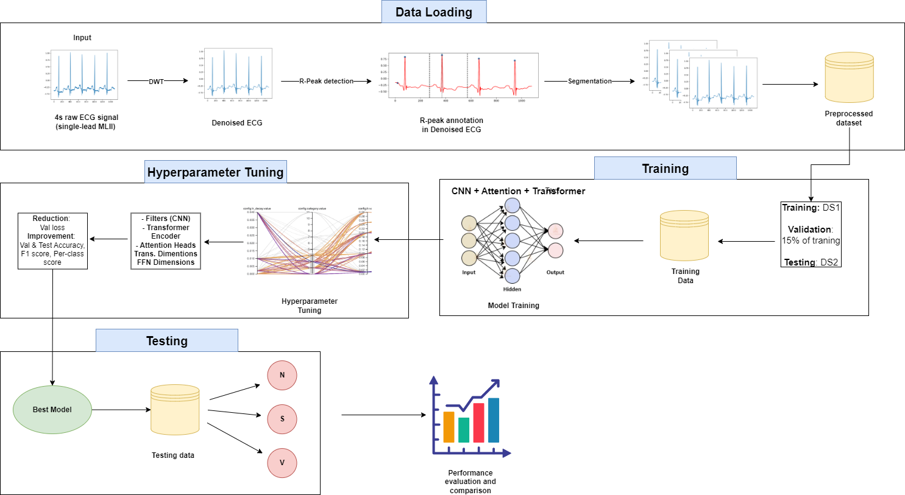

# Convolution, Attention, and Transformer-based network for single-lead ECG arrhythmia classification

## Introduction
To enable adoption in practice of heart arrhythmia detection and classification applications via single-lead
ECG devices and smart devices, I propose a CNN-Transformer-based hybrid network for the detection
and classification of heart arrhythmia.
- CNN computes ECG local features, channel attention extracts the most relevant portion
- Transformer contextualizes the ECG feature map in latent space.
- The incorporation of channel attention after CNN and transformer on the ECG feature map
enabled to focus on local, significant, and global contextualization, making our model superior to
the existing state-of the-art models.

## Methodology
The overview of proposed method is shown as Fig 1

## Model Architecture
The classification model architecture consists of three main components: CNN, attention mechanism, and transformer encoder.

Summary of parameters for the proposed CAT-Net model

## Results
- The model is trained with ‘adam’ optimizer for 30 epochs. Only 15% of training data is considered as validation data. The result of training duration is shown as below:

- The model architecture and hyperparameters after tuning then the best values of hyperparameters used for the whole model and transformer encoder are presented in Table below:

- The classification model performance is assessed via accuracy, sensitivity, specificity, and F1 score. The per-class accuracy, sensitivity,
and specificity are also computed. 

## Conclusion
The model’s robustness is validated across two distinct datasets, and it exhibits consistent performance following AAMI EC57 standard. The proposed model can be used in IoT-based and mobile arrhythmia diagnosis systems due to the low requirement of working in realtime with patients’ ECG data captured by only one sensing device.